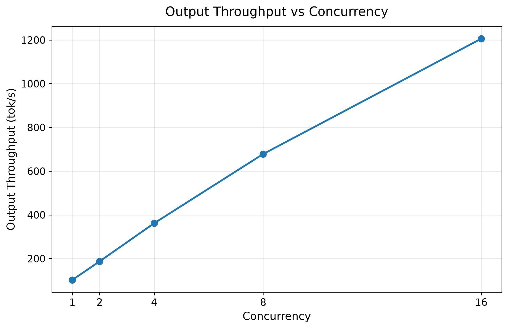
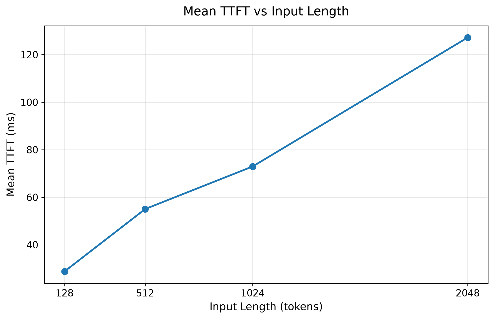
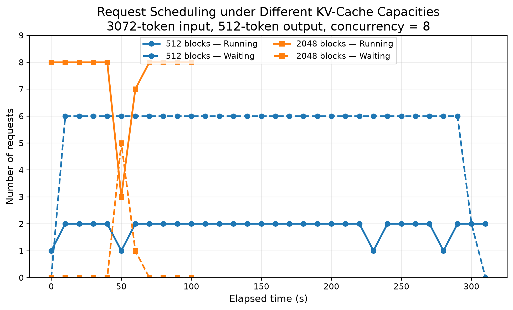
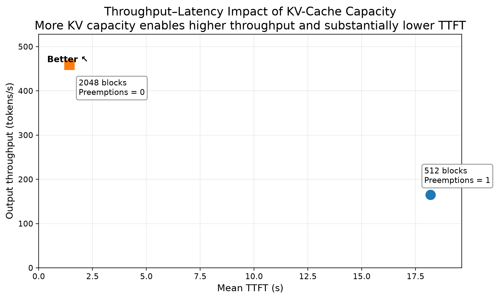

# LLM Serving Performance Benchmark with vLLM

A hands-on ML Systems project for studying **LLM inference, scheduling, KV-cache behavior, and serving performance** with **vLLM**.

The project deploys **Qwen2.5-3B-Instruct** on a single **NVIDIA RTX 3090 24GB** GPU and uses controlled synthetic workloads to measure **throughput, TTFT, TPOT, ITL, tail latency, prefix-cache reuse, scheduler queueing, and preemption**.

## Highlights

- **Concurrency scaling:** increasing concurrency from 1 to 16 raised output throughput from **102.32 to 1205.90 tok/s** (~11.8×), while tail latency increased.
- **Context-length scaling:** increasing input length from 128 to 2048 tokens increased mean TTFT from **28.79 to 127.23 ms** (~4.4×), while mean TPOT stayed near **9.4 ms/token**.
- **Prefix caching:** reusing a 1536-token shared prefix reduced mean TTFT by **63.8%** and increased output throughput by **10.7%**, with almost no TPOT change.
- **Chunked prefill:** tuning the scheduler token budget to 1024 reduced **P99 ITL by 62.7%** versus the non-chunked baseline while keeping output throughput within ~1% of baseline.
- **KV-cache pressure:** increasing the controlled KV-cache capacity from 512 to 2048 blocks reduced mean TTFT from **18.19 s to 1.42 s**, increased output throughput from **164.90 to 459.32 tok/s**, and eliminated the observed preemption.

## Experimental Setup

| Component | Configuration |
|---|---|
| GPU | NVIDIA GeForce RTX 3090 24GB |
| Model | Qwen2.5-3B-Instruct |
| OS | Ubuntu 22.04 |
| Python | 3.12 |
| PyTorch | 2.9.0+cu128 |
| CUDA | 12.8 |
| vLLM | 0.11.2 |
| Workloads | Controlled synthetic requests |

The model weights were downloaded through ModelScope for reliable access from the cloud environment.

## Metrics

- **Output Throughput:** generated output tokens per second.
- **TTFT:** time from request submission to the first generated token.
- **TPOT:** average time per output token after the first token.
- **ITL:** latency between consecutive output tokens.
- **P99:** tail latency for the slowest requests.

---

## Stage 1 — Environment Setup and Model Deployment

Built the serving environment, deployed Qwen2.5-3B-Instruct with vLLM, started an OpenAI-compatible API server, and validated end-to-end inference requests.

[Details](docs/stage1_setup.md)

---

## Stage 2 — Baseline Benchmark

Established a reproducible single-concurrency baseline using 100 requests with 512-token inputs and 128-token outputs.

| Metric | Result |
|---|---:|
| Request Throughput | 0.799 req/s |
| Output Throughput | 102.32 tok/s |
| Mean TTFT | 62.64 ms |
| P99 TTFT | 72.42 ms |
| Mean TPOT | 9.35 ms |
| P99 TPOT | 9.49 ms |

[Details](docs/stage2_baseline.md)

---

## Stage 3 — Concurrency Scaling

Varied maximum concurrency from **1 → 2 → 4 → 8 → 16** while keeping the workload fixed.

**Key result:** output throughput increased from **102.32 to 1205.90 tok/s**, but TPOT and P99 TTFT also increased at higher concurrency, demonstrating the serving **throughput-latency trade-off**. Throughput was still rising at concurrency 16, so saturation was not reached.



[Details](docs/stage3_concurrency.md)

---

## Stage 4 — Context Length Scaling

Varied input length from **128 → 512 → 1024 → 2048 tokens** with concurrency fixed at 1.

**Key result:** mean TTFT increased from **28.79 to 127.23 ms**, while mean TPOT remained nearly constant at **~9.4 ms/token**. Under this workload, longer prompts primarily increased **prefill cost**, while decode token latency remained stable.



[Details](docs/stage4_context_length.md)

---

## Stage 5 — Project V1 Milestone

Consolidated the baseline, concurrency, and context-length experiments into a reproducible project structure with raw results, processed data, visualizations, and documentation.

---

## Stage 6 — Automatic Prefix Caching

Constructed a workload with a **1536-token shared prefix + 512-token unique suffix** and compared Prefix Caching OFF vs ON.

**Key results:**

- Mean TTFT: **222.99 → 80.75 ms** (**-63.8%**)
- P99 TTFT: **236.51 → 92.94 ms** (**-60.7%**)
- Output Throughput: **89.75 → 99.33 tok/s** (**+10.7%**)
- Mean TPOT remained essentially unchanged at **~9.5 ms/token**

This shows that prefix caching primarily reduces **repeated prefill computation**, rather than decode cost.


[Details](docs/stage6_prefix_caching.md)

---

## Stage 7 — Chunked Prefill and Scheduler Token Budget

Evaluated Chunked Prefill on a long-prompt workload (**3072-token input, 128-token output, concurrency 8**) and tuned:

```text
max_num_batched_tokens: 4096 → 2048 → 1024
```

**Key result:** reducing the scheduler token budget to 1024 lowered **P99 ITL from 306.99 ms to 114.42 ms (-62.7%)** versus the non-chunked baseline, while output throughput remained nearly unchanged (**250.95 vs 253.64 tok/s**).

The experiment shows that finer-grained prefill scheduling can substantially improve **decode tail latency**, but introduces trade-offs in mean ITL, TTFT, and throughput.

### Multi-Metric Trade-off


### Decode Tail Latency vs Token Budget


[Details](docs/stage7_chunked_prefill.md)


---

## Stage 8 — Scheduler, KV-Cache Pressure, and Preemption

Studied two different sources of request queueing.

### Scheduler-capacity queueing

With **max concurrency = 8** and **max_num_seqs = 4**, the server observed up to **4 Running / 4 Waiting** requests while KV-cache utilization stayed below **3%**.

This separates **scheduler admission pressure** from memory pressure: requests can wait even when KV cache is mostly empty.

### KV-cache pressure

Used `num_gpu_blocks_override` to create a controlled KV-cache stress test.

| Metric | 512 Blocks | 2048 Blocks |
|---|---:|---:|
| Typical Running Requests | 1–2 | 8 |
| Typical Waiting Requests | ~6 | 0 |
| Mean TTFT | 18.19 s | 1.42 s |
| P99 TTFT | 19.15 s | 2.33 s |
| Output Throughput | 164.90 tok/s | 459.32 tok/s |
| Observed Preemptions | 1 | 0 |

Increasing KV-cache capacity reduced mean TTFT by **92.2%**, increased output throughput by **178.5%**, and eliminated the observed preemption.





[Details](docs/stage8_scheduler_preemption.md)

---

## Project Structure

```text
llm-serving-benchmark/
├── README.md
├── docs/
│   ├── stage1_setup.md
│   ├── stage2_baseline.md
│   ├── stage3_concurrency.md
│   ├── stage4_context_length.md
│   ├── stage6_prefix_caching.md
│   ├── stage7_chunked_prefill.md
│   └── stage8_scheduler_preemption.md
├── scripts/
│   ├── start_server.sh
│   └── send_request.sh
├── analysis/
│   ├── plot_concurrency.py
│   ├── plot_context_length.py
│   ├── plot_prefix_cache.py
│   ├── plot_chunked_prefill.py
│   └── plot_scheduler_preemption.py
├── results/
│   ├── raw/
│   └── processed/
├── figures/
└── .gitignore
```

## What This Project Demonstrates

- Controlled benchmarking of a real GPU-backed LLM serving system
- Analysis of **prefill vs decode** behavior using TTFT, TPOT, and ITL
- Measurement of **throughput-latency trade-offs** under increasing request load
- Evaluation of **KV-cache reuse** through Automatic Prefix Caching
- Scheduler tuning with **Chunked Prefill** and token budgets
- Direct observation of **Running / Waiting queues, KV-cache pressure, and preemption**

## Roadmap

Completed:

- [x] Stage 1: Environment setup and model deployment
- [x] Stage 2: Baseline benchmark
- [x] Stage 3: Concurrency scaling
- [x] Stage 4: Context length scaling
- [x] Stage 5: Project V1 milestone
- [x] Stage 6: Automatic Prefix Caching
- [x] Stage 7: Chunked Prefill
- [x] Stage 8: Scheduler / KV-cache pressure / preemption


## Notes

This project focuses on **systems behavior and serving performance**, not model quality.

The experiments use controlled synthetic workloads. Stage 8 intentionally uses `num_gpu_blocks_override` as a stress-test mechanism to isolate KV-cache capacity effects.
