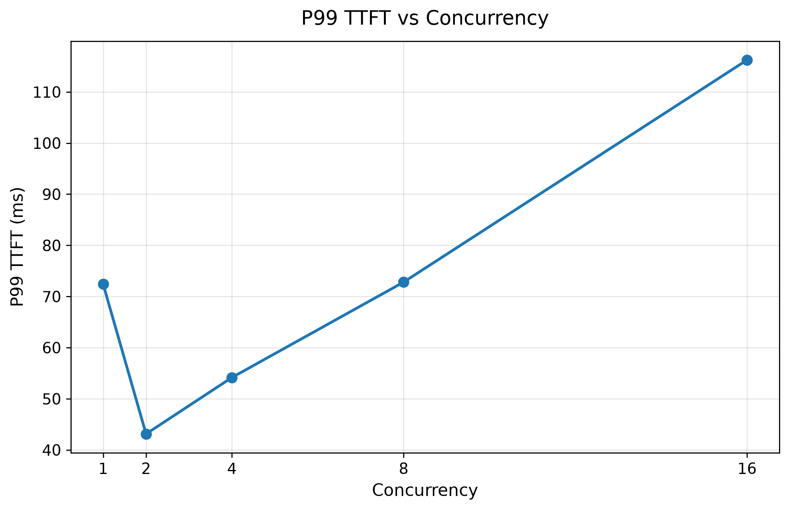
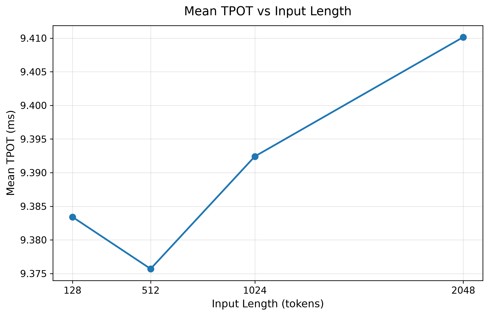

# LLM Serving Performance Benchmark

A hands-on ML Systems project for studying the performance characteristics of LLM inference and serving with **vLLM**.

This project deploys **Qwen2.5-3B-Instruct** on a single **NVIDIA RTX 3090 24GB** GPU and evaluates how serving performance changes under different request concurrency levels and input context lengths.

## Project Goals

The main goals of this project are to:

- Build and deploy an LLM serving system with vLLM
- Measure serving performance using controlled synthetic workloads
- Study the throughput-latency trade-off under different concurrency levels
- Study how input context length affects prefill latency and decoding performance
- Build a reproducible workflow for LLM serving experiments

## Environment

- GPU: NVIDIA GeForce RTX 3090 24GB
- OS: Ubuntu 22.04
- Python: 3.12
- PyTorch: 2.9.0+cu128
- CUDA: 12.8
- vLLM: 0.11.2
- Model: Qwen2.5-3B-Instruct

The model weights were downloaded through ModelScope for more reliable access from the cloud environment.

## Project Structure

```text
llm-serving-benchmark/
├── README.md
├── docs/
│   ├── stage1_setup.md
│   ├── stage2_baseline.md
│   ├── stage3_concurrency.md
│   └── stage4_context_length.md
├── scripts/
│   ├── start_server.sh
│   └── send_request.sh
├── analysis/
│   ├── plot_concurrency.py
│   └── plot_context_length.py
├── results/
│   ├── raw/
│   └── processed/
├── figures/
└── .gitignore
```

## Stage 1: Environment Setup and Model Deployment

The first stage focused on building the serving environment.

Completed tasks:

- Created an isolated Python virtual environment
- Installed and configured vLLM
- Deployed Qwen2.5-3B-Instruct on RTX 3090
- Started an OpenAI-compatible API server
- Successfully sent inference requests through HTTP API
- Used tmux to manage long-running server processes

More details: [Stage 1 Setup](docs/stage1_setup.md)

## Stage 2: Baseline Benchmark

The baseline experiment sends a controlled workload of fixed-length synthetic requests to vLLM.

> 给 vLLM 连续发送一批固定为 512-token 输入、128-token 输出的 synthetic requests，测量这套 serving system 在单并发条件下的基础性能。

Baseline configuration:

| Parameter | Value |
|---|---|
| Input length | 512 tokens |
| Output length | 128 tokens |
| Requests | 100 |
| Maximum concurrency | 1 |

Baseline result:

| Metric | Value |
|---|---:|
| Request throughput | 0.799 req/s |
| Output throughput | 102.32 tok/s |
| Mean TTFT | 62.64 ms |
| P99 TTFT | 72.42 ms |
| Mean TPOT | 9.35 ms |
| P99 TPOT | 9.49 ms |

More details: [Stage 2 Baseline](docs/stage2_baseline.md)

## Stage 3: Concurrency Scaling

This experiment studies how increasing request concurrency affects serving throughput and latency.

All workload parameters remain fixed while maximum concurrency changes:

```text
1 → 2 → 4 → 8 → 16
```

### Results

| Concurrency | Output Throughput (tok/s) | Mean TTFT (ms) | P99 TTFT (ms) | Mean TPOT (ms) |
|---:|---:|---:|---:|---:|
| 1 | 102.32 | 62.64 | 72.42 | 9.35 |
| 2 | 187.17 | 31.43 | 43.12 | 10.52 |
| 4 | 361.62 | 39.96 | 54.16 | 10.81 |
| 8 | 678.36 | 48.95 | 72.81 | 11.03 |
| 16 | 1205.90 | 72.67 | 116.24 | 11.53 |

### Throughput vs Concurrency


### P99 TTFT vs Concurrency



### Key Findings

- Output throughput increased from about **102 tok/s** to about **1206 tok/s** as concurrency increased from 1 to 16.
- Mean TPOT gradually increased from **9.35 ms/token** to **11.53 ms/token**.
- P99 TTFT increased significantly at higher concurrency.
- The experiment demonstrates the typical **throughput-latency trade-off** in LLM serving.
- Throughput was still increasing at concurrency 16, so the saturation point was not reached in this experiment.

More details: [Stage 3 Concurrency Scaling](docs/stage3_concurrency.md)

## Stage 4: Context Length Scaling

This experiment studies how longer input prompts affect serving performance.

Only input length changes:

```text
128 → 512 → 1024 → 2048 tokens
```

The following parameters remain fixed:

- Output length: 128 tokens
- Requests: 100
- Maximum concurrency: 1

### Results

| Input Length | Output Throughput (tok/s) | Mean TTFT (ms) | P99 TTFT (ms) | Mean TPOT (ms) |
|---:|---:|---:|---:|---:|
| 128 | 104.82 | 28.79 | 32.22 | 9.38 |
| 512 | 102.70 | 55.05 | 63.19 | 9.38 |
| 1024 | 101.07 | 72.96 | 80.42 | 9.39 |
| 2048 | 96.75 | 127.23 | 137.00 | 9.41 |

### Mean TTFT vs Input Length


### Mean TPOT vs Input Length



### Key Findings

- Mean TTFT increased from **28.79 ms** at 128 input tokens to **127.23 ms** at 2048 input tokens.
- P99 TTFT also increased significantly as the prompt became longer.
- Mean TPOT remained almost unchanged at approximately **9.4 ms/token**.
- Output token throughput decreased only moderately.
- Under this controlled workload, longer input context primarily increases **prefill latency**, while decode token latency remains relatively stable.

More details: [Stage 4 Context Length](docs/stage4_context_length.md)

## Metrics

### TTFT — Time To First Token

The time between sending a request and receiving the first generated token.

TTFT is strongly affected by prompt processing and prefill latency.

### TPOT — Time Per Output Token

The average time required to generate each output token after the first token.

TPOT is mainly used to characterize decode performance.

### P99 Latency

The 99th percentile latency.

It helps capture tail latency and the experience of the slowest requests, which may not be visible from average latency alone.

## Current Findings

The experiments so far show two clear system-level behaviors:

1. **Increasing concurrency improves overall throughput but increases per-request latency and tail latency.**
2. **Increasing input context length significantly increases TTFT while TPOT remains almost stable.**

Together, these experiments demonstrate the different effects of request load and prompt length on LLM serving performance.

## Roadmap

Completed:

- [x] Stage 1: Environment setup and model deployment
- [x] Stage 2: Baseline serving benchmark
- [x] Stage 3: Concurrency scaling experiment
- [x] Stage 4: Context length experiment

Planned:

- [ ] Prefix caching experiment
- [ ] Chunked prefill analysis
- [ ] KV cache pressure analysis
- [ ] Scheduler and preemption analysis
- [ ] Higher-concurrency saturation study

## Notes

This project focuses on **systems behavior and serving performance**, rather than model quality.

All current benchmark results were collected using the same model and physical GPU to keep comparisons consistent.
