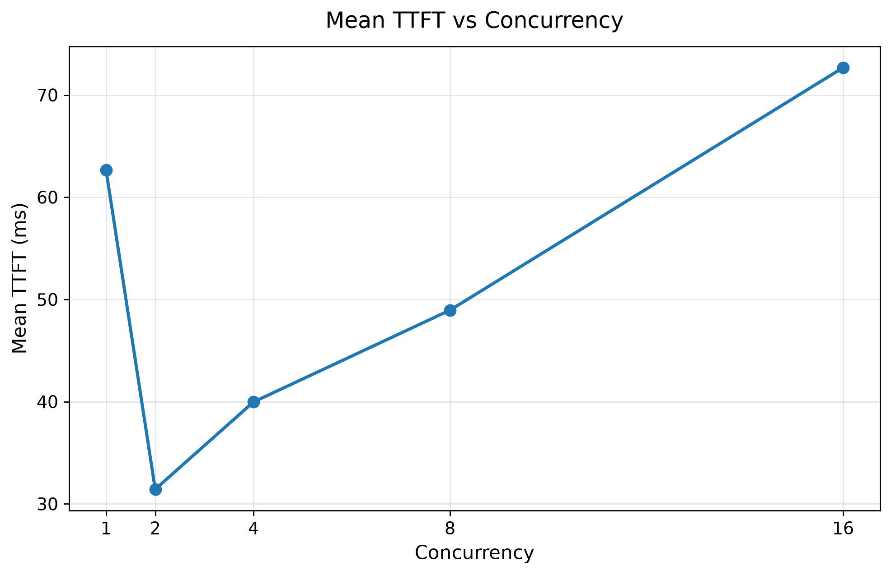
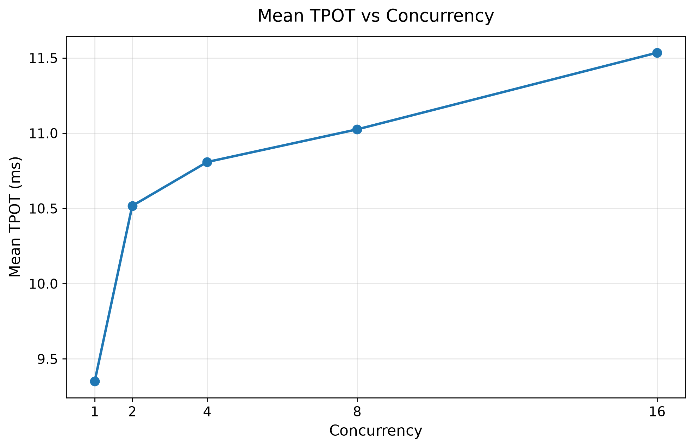

# Stage 3: Concurrency Scaling Experiment

## 1. Stage Goal

Stage 3 的目标是研究：当多个用户同时向 vLLM 发送请求时，系统的吞吐量（throughput）和延迟（latency）会如何变化。

核心研究问题：

> 当并发请求数量不断增加时，vLLM 如何在更高吞吐量和更高延迟之间进行权衡？

本阶段采用控制变量实验。除了 `max_concurrency` 之外，其余实验条件保持不变。

## 2. Experiment Environment

### Hardware

- GPU: NVIDIA GeForce RTX 3090 24GB

### Software

- vLLM: 0.11.2
- PyTorch: 2.9.0+cu128
- CUDA: 12.8

### Model

- Qwen2.5-3B-Instruct

## 3. Workload Design

本阶段继续使用 random synthetic dataset，以保证不同实验之间的输入输出长度一致。

固定条件：

| Parameter | Value |
|---|---|
| Input length | 512 tokens |
| Output length | 128 tokens |
| Number of requests | 100 |
| Dataset | random synthetic dataset |
| Request rate | inf |

唯一改变的变量：

| Experiment | Maximum Concurrency |
|---|---:|
| Baseline | 1 |
| C2 | 2 |
| C4 | 4 |
| C8 | 8 |
| C16 | 16 |

这样可以更清楚地观察并发度变化对 serving performance 的影响。

## 4. Benchmark Results

| Concurrency | Output Throughput (tok/s) | Mean TTFT (ms) | P99 TTFT (ms) | Mean TPOT (ms) | P99 TPOT (ms) |
|---:|---:|---:|---:|---:|---:|
| 1 | 102.32 | 62.64 | 72.42 | 9.35 | 9.49 |
| 2 | 187.17 | 31.43 | 43.12 | 10.52 | 10.71 |
| 4 | 361.62 | 39.96 | 54.16 | 10.81 | 10.93 |
| 8 | 678.36 | 48.95 | 72.81 | 11.03 | 11.32 |
| 16 | 1205.90 | 72.67 | 116.24 | 11.53 | 11.69 |

## 5. Result Analysis

### 5.1 Throughput Scaling

随着 concurrency 从 1 增加到 16，output token throughput 从约 102 tok/s 提升到约 1206 tok/s。

这说明更高的并发度可以让 vLLM 更充分地利用 GPU，并通过 batching 和 continuous batching 提升整体吞吐量。

不过，throughput 并没有随着 concurrency 完全线性增长。Concurrency 增加 16 倍时，throughput 大约提升到原来的 11.8 倍。

这说明 GPU 利用率虽然明显提高，但系统中仍然存在调度、batching 和计算资源方面的额外开销。

### 5.2 TTFT Behavior

Mean TTFT 的变化为：

- Concurrency 1: 62.64 ms
- Concurrency 2: 31.43 ms
- Concurrency 4: 39.96 ms
- Concurrency 8: 48.95 ms
- Concurrency 16: 72.67 ms

在本次实验中，Concurrency 2 的 TTFT 最低，之后随着 concurrency 增加而逐渐上升。

目前不能仅根据这一组实验直接判断 Concurrency 1 到 2 时 TTFT 下降的具体原因。它可能与请求调度方式、batch formation、请求时序或 warm-up 状态有关。

因此，这个现象需要在后续重复实验中进一步验证。

### 5.3 Tail Latency

P99 TTFT 在高并发条件下明显增加：

- Concurrency 2: 43.12 ms
- Concurrency 4: 54.16 ms
- Concurrency 8: 72.81 ms
- Concurrency 16: 116.24 ms

这说明随着系统负载增加，最慢一部分请求的等待时间逐渐变长。

P99 latency 可以反映 tail latency，因此它比单纯的平均延迟更能体现高负载条件下的用户体验。

### 5.4 TPOT

Mean TPOT 从：

- 9.35 ms/token at Concurrency 1

增加到：

- 11.53 ms/token at Concurrency 16

变化幅度相对 TTFT 更小，但总体呈上升趋势。

这表示随着并发请求增多，单个请求在 decode 阶段生成每个 token 的平均时间有所增加。

## 6. Throughput-Latency Trade-off

本阶段最重要的观察是：

> 随着 concurrency 增加，vLLM 的整体 throughput 明显提高，但单请求 latency 和 tail latency 也逐渐增加。

这体现了 LLM serving 中典型的 throughput-latency trade-off。

更高并发度可以提高 GPU 利用率和整体系统吞吐量，但也可能带来更多排队、调度和资源竞争，从而增加部分请求的延迟。

## 7. Figures

### Output Throughput vs Concurrency

### Mean TTFT vs Concurrency

### P99 TTFT vs Concurrency

### Mean TPOT vs Concurrency

## 8. Stage 3 Conclusion

Stage 3 successfully completed a concurrency scaling benchmark under controlled conditions.

本阶段完成：

- 5 组 concurrency benchmark
- concurrency = 1 / 2 / 4 / 8 / 16
- JSON benchmark result collection
- pandas DataFrame processing
- concurrency summary CSV generation
- throughput / TTFT / P99 TTFT / TPOT visualization
- throughput-latency trade-off analysis

目前为止，在 Concurrency 16 时 throughput 仍然持续明显上升，因此还不能认为系统已经达到 saturation point。
后续如果需要进一步研究系统饱和点，可以继续测试更高并发度，例如 32 或 64。
