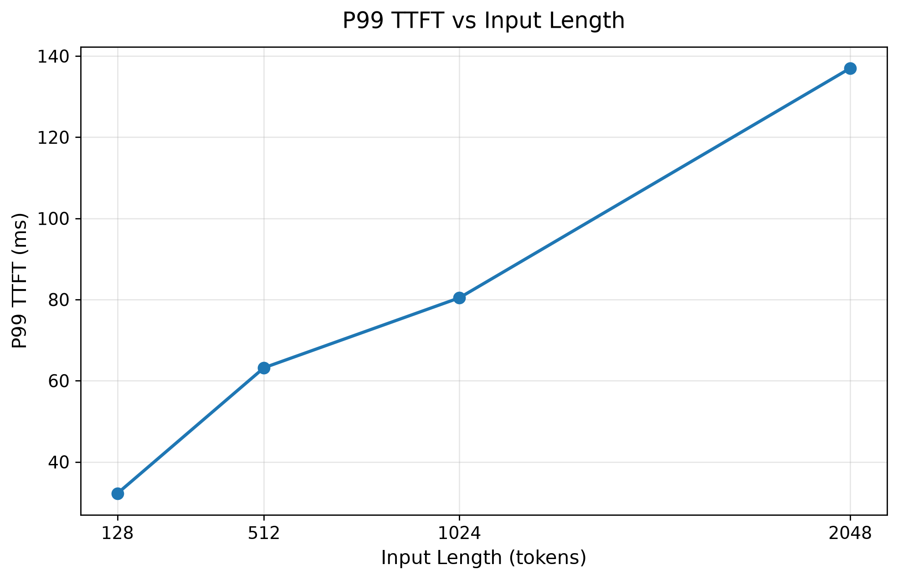
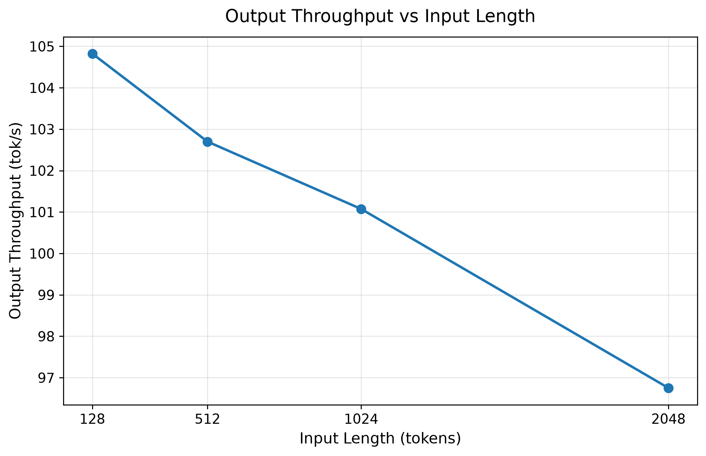

# Stage 4: Context Length Experiment

## 1. Stage Goal

Stage 4 的目标是研究：当输入 prompt / context length 逐渐变长时，LLM serving system 的性能会发生什么变化。

本阶段继续使用控制变量实验，只改变 input length，其余条件保持不变。

核心研究问题：

> 当 input context 从 128 tokens 增加到 2048 tokens 时，prefill latency、TTFT、TPOT 和 output throughput 会如何变化？

## 2. Experiment Environment

### Hardware
- GPU: NVIDIA GeForce RTX 3090 24GB

### Software
- vLLM: 0.11.2
- PyTorch: 2.9.0+cu128
- CUDA: 12.8

### Model
- Qwen2.5-3B-Instruct

## 3. Workload Design

固定条件：

| Parameter | Value |
|---|---|
| Output length | 128 tokens |
| Number of requests | 100 |
| Maximum concurrency | 1 |
| Dataset | random synthetic dataset |
| Request rate | inf |

唯一改变的变量：

| Experiment | Input Length |
|---|---:|
| C128 | 128 tokens |
| C512 | 512 tokens |
| C1024 | 1024 tokens |
| C2048 | 2048 tokens |

## 4. Benchmark Results

| Input Length | Output Throughput (tok/s) | Mean TTFT (ms) | P99 TTFT (ms) | Mean TPOT (ms) | P99 TPOT (ms) |
|---:|---:|---:|---:|---:|---:|
| 128 | 104.82 | 28.79 | 32.22 | 9.38 | 9.55 |
| 512 | 102.70 | 55.05 | 63.19 | 9.38 | 9.55 |
| 1024 | 101.07 | 72.96 | 80.42 | 9.39 | 9.54 |
| 2048 | 96.75 | 127.23 | 137.00 | 9.41 | 9.59 |

## 5. Result Analysis

### 5.1 TTFT Increases with Input Length

Mean TTFT 随着 input length 增加而明显上升：

- 128 tokens: 28.79 ms
- 512 tokens: 55.05 ms
- 1024 tokens: 72.96 ms
- 2048 tokens: 127.23 ms

从 128 tokens 增加到 2048 tokens 后，Mean TTFT 大约增加到原来的 4.4 倍。

更长的 prompt 需要在 prefill 阶段处理更多 input tokens，因此模型需要更长时间才能生成第一个 output token。

> 更长的 input context 主要增加 prefill 阶段的计算开销，因此会显著提高 TTFT。

### 5.2 P99 TTFT Also Increases

P99 TTFT 同样随着 input length 增加：

- 128 tokens: 32.22 ms
- 512 tokens: 63.19 ms
- 1024 tokens: 80.42 ms
- 2048 tokens: 137.00 ms

这说明不仅平均首 token 延迟变高，tail latency 也随 context length 增长而增加。

### 5.3 TPOT Remains Almost Stable

Mean TPOT 的变化非常小：

- 128 tokens: 9.38 ms/token
- 512 tokens: 9.38 ms/token
- 1024 tokens: 9.39 ms/token
- 2048 tokens: 9.41 ms/token

这意味着在当前单并发、固定 output length 的实验条件下，input length 增长主要影响 prefill 阶段，而 decode 阶段每生成一个 token 的平均时间基本保持稳定。

这一结果直观体现了 Prefill 和 Decode 两个阶段的区别：

- Prefill：需要处理整个输入 prompt，因此对 input length 更敏感
- Decode：逐 token 生成输出，本实验中 TPOT 基本稳定

### 5.4 Output Throughput Slightly Decreases

Output token throughput 从 104.82 tok/s 下降到 96.75 tok/s，下降约 7.7%。

因为更长的输入增加了每个请求的 prefill 时间，所以整个 benchmark 中用于生成 output tokens 的有效时间比例有所降低。

## 6. Key Observation

本阶段最重要的观察是：

> 随着 input context 变长，TTFT 和 P99 TTFT 明显上升，而 TPOT 基本保持稳定。

这说明在当前实验条件下，context length 对 prefill latency 的影响远大于对 decode token latency 的影响。

## 7. Figures

### Mean TTFT vs Input Length

### P99 TTFT vs Input Length

### Mean TPOT vs Input Length

### Output Throughput vs Input Length

## 8. Stage 4 Conclusion

Stage 4 successfully completed a context length scaling benchmark under controlled conditions.

- 更长的 context 会显著增加 TTFT
- P99 TTFT 也随 context length 增加
- TPOT 基本保持稳定
- Output throughput 小幅下降