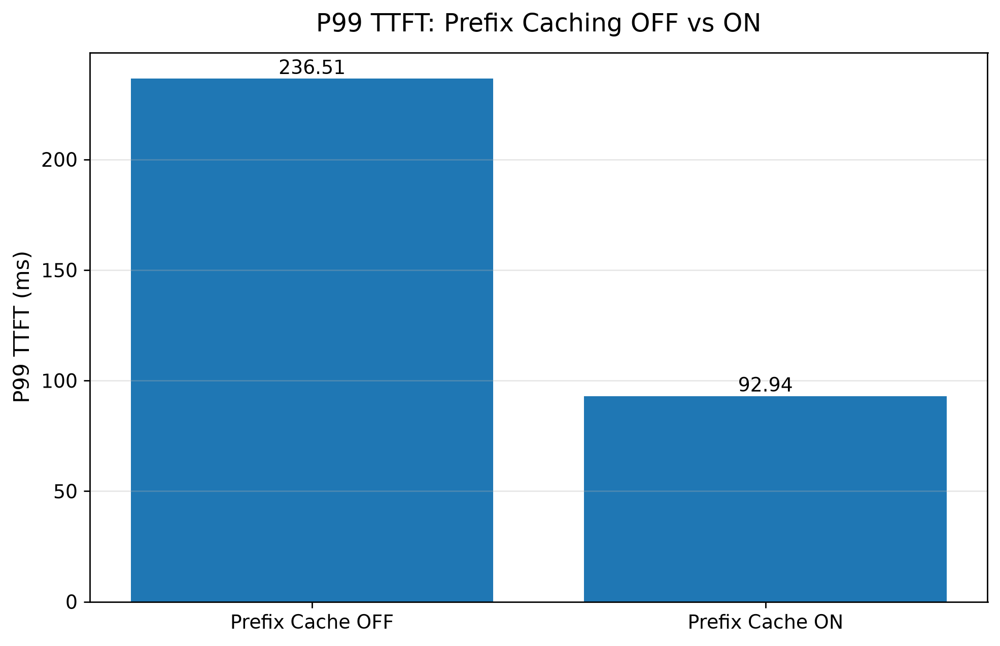
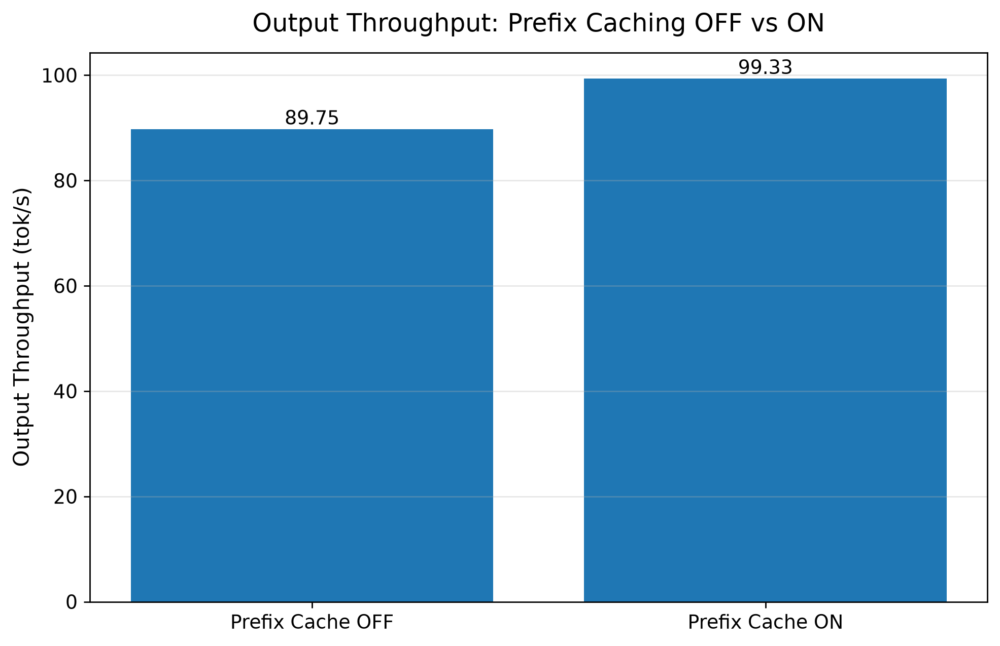
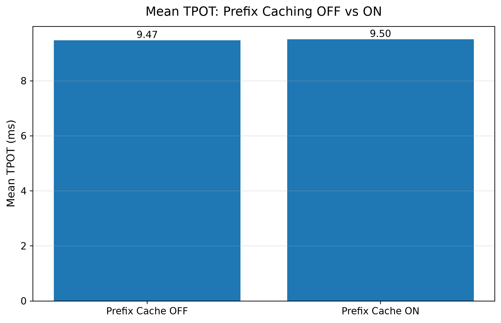

# Stage 6：Prefix Caching 实验

## 1. 阶段目标

Stage 6 的目标是研究：

> 当多个请求共享较长的相同 prefix 时，vLLM 的 Prefix Caching 能否通过复用已经计算过的 KV Cache，减少重复的 prefill computation，从而降低 TTFT 并提升 serving performance。

本阶段采用 A/B 实验：

- A：Prefix Caching OFF
- B：Prefix Caching ON

除了 Prefix Caching 开关之外，其余实验条件保持一致。

---

## 2. 实验环境

### Hardware

- GPU：NVIDIA GeForce RTX 3090 24GB

### Software

- vLLM：0.11.2
- PyTorch：2.9.0+cu128
- CUDA：12.8

### Model

- Qwen2.5-3B-Instruct

---

## 3. Prefix 与 Prefix Caching

在多个请求中，如果开头有一段完全相同的 token sequence，这一部分可以看作 shared prefix。

例如：

```text
Request 1:
[Shared Prefix][Unique Suffix 1]

Request 2:
[Shared Prefix][Unique Suffix 2]

Request 3:
[Shared Prefix][Unique Suffix 3]
```

在 Prefix Caching 关闭时，每个请求都需要重新处理完整输入，并重新完成 shared prefix 对应的 prefill computation。

在 Prefix Caching 开启后，vLLM 可以复用已经计算过的 shared prefix 对应的 KV Cache，从而避免重复计算相同的 prefix。

需要注意：

> Prefix Caching 缓存的不是模型最终回答，而是 prefix 在 prefill 阶段已经计算得到的 KV Cache。

---

## 4. Workload Design

本阶段每个 request 的输入由两部分组成：

```text
1536-token shared prefix
+
512-token unique suffix
=
2048-token total input
```

固定实验参数：

| Parameter | Value |
|---|---:|
| Shared Prefix Length | 1536 tokens |
| Unique Suffix Length | 512 tokens |
| Total Input Length | 2048 tokens |
| Output Length | 128 tokens |
| Number of Requests | 100 |
| Maximum Concurrency | 1 |
| Request Rate | inf |
| Dataset | random synthetic workload |

唯一改变的变量：

| Experiment | Prefix Caching |
|---|---|
| A | OFF |
| B | ON |

---

## 5. 实验配置验证

本阶段实验过程中先发现了一次配置问题。

原始 `start_server.sh` 中：

```bash
"$@"
```

没有正确接在 `vllm serve` 命令后，因此传入的：

```bash
--no-enable-prefix-caching
```

并没有真正传递给 vLLM。

修正后，`start_server.sh` 使用：

```bash
vllm serve /root/autodl-tmp/models/Qwen2.5-3B-Instruct \
  --host 0.0.0.0 \
  --port 8000 \
  --max-model-len 4096 \
  "$@"
```

从而可以通过：

```bash
./scripts/start_server.sh --no-enable-prefix-caching
```

或：

```bash
./scripts/start_server.sh --enable-prefix-caching
```

控制 Prefix Caching。

### Prefix Caching OFF

通过 `/metrics` 验证：

```text
enable_prefix_caching="False"
```

并且：

```text
prefix_cache_queries_total = 0
prefix_cache_hits_total = 0
```

说明 OFF 组中 Prefix Caching 确实没有参与。

### Prefix Caching ON

通过 `/metrics` 验证：

```text
enable_prefix_caching="True"
```

并且实验后 `prefix_cache_hits_total > 0`。

在一次 ON 运行中：

```text
prefix_cache_queries_total = 206848
prefix_cache_hits_total = 163600
```

说明 shared prefix 确实发生了 KV Cache reuse。

---

## 6. Benchmark Results

| Metric | Prefix Cache OFF | Prefix Cache ON | Change |
|---|---:|---:|---:|
| Benchmark Duration (s) | 142.62 | 128.86 | -9.65% |
| Request Throughput (req/s) | 0.70 | 0.78 | +11.43% |
| Output Throughput (tok/s) | 89.75 | 99.33 | +10.67% |
| Mean TTFT (ms) | 222.99 | 80.75 | -63.79% |
| P99 TTFT (ms) | 236.51 | 92.94 | -60.70% |
| Mean TPOT (ms) | 9.47 | 9.50 | 基本不变 |
| P99 TPOT (ms) | 9.61 | 9.67 | 基本不变 |

---

## 7. Result Analysis

### 7.1 Prefix Caching 显著降低 TTFT

Mean TTFT 从：

```text
222.99 ms
```

下降到：

```text
80.75 ms
```

下降约：

```text
63.8%
```

P99 TTFT 从：

```text
236.51 ms
```

下降到：

```text
92.94 ms
```

下降约：

```text
60.7%
```

这说明当多个 request 共享较长 prefix 时，Prefix Caching 可以显著减少生成第一个 output token 之前的等待时间。

原因是 shared prefix 对应的 KV Cache 可以被后续请求复用，因此不需要每次都重新完成全部 prefix 的 prefill computation。

需要注意：

> TTFT 不等于纯粹的 prefill latency。

TTFT 还可能包含 scheduling、queueing 以及其他 serving overhead，因此这里更准确的说法是：

> Prefix Caching 通过减少重复 prefill computation，显著降低了端到端 TTFT。

---

### 7.2 TPOT 基本保持不变

Mean TPOT：

```text
OFF: 9.47 ms/token
ON:  9.50 ms/token
```

几乎没有变化。

这与 Prefix Caching 的工作机制一致。

Prefix Caching 主要作用于：

```text
Input
  ↓
Prefill
  ↓
First Token
  ↓
Decode
```

它减少的是 shared prefix 的重复 prefill computation，而不会直接加速后续逐 token 的 decode process。

因此：

```text
TTFT 明显下降
TPOT 基本不变
```

正是本阶段最重要的现象之一。

---

### 7.3 Output Throughput 提升约 10.7%

Output Throughput 从：

```text
89.75 tok/s
```

提升到：

```text
99.33 tok/s
```

提升约：

```text
10.7%
```

虽然 Mean TTFT 降低了约 64%，但整体 output throughput 并没有提升 64%。

这是因为一个完整 request 的执行过程不仅包含 Prefill，还包含后续 128 个 output tokens 的 Decode：

```text
Total Request Time
=
Prefill
+
Decode
```

Prefix Caching 减少了部分 Prefill cost，但 Decode 仍然需要正常执行。

因此：

```text
TTFT 大幅下降
Output Throughput 中等幅度提升
```

并不矛盾。

---

### 7.4 Benchmark Duration 下降

Benchmark Duration 从：

```text
142.62 s
```

下降到：

```text
128.86 s
```

下降约：

```text
9.65%
```

与 Output Throughput 提升的结果一致。

---

## 8. Figures

### Mean TTFT


### P99 TTFT



### Output Throughput



### Mean TPOT



---

## 9. Key Findings

> 如果长 context 中存在大量重复的 shared prefix，能不能通过 KV Cache reuse 减少重复 prefill computation？

实验结果表明可以。

> 对于具有较长 shared prefix 的 workload，Prefix Caching 可以显著降低 TTFT，同时对 TPOT 几乎没有影响。

在本实验条件下：

```text
Shared Prefix: 1536 tokens
Unique Suffix:  512 tokens
Total Input:   2048 tokens
Output:         128 tokens
Concurrency:      1
```

开启 Prefix Caching 后：

- Mean TTFT 下降约 **63.8%**
- P99 TTFT 下降约 **60.7%**
- Output Throughput 提升约 **10.7%**
- Mean TPOT 基本保持在 **9.5 ms/token**

这说明 Prefix Caching 主要优化了重复 prefix 带来的 prefill overhead，而不是 decode per-token latency。
