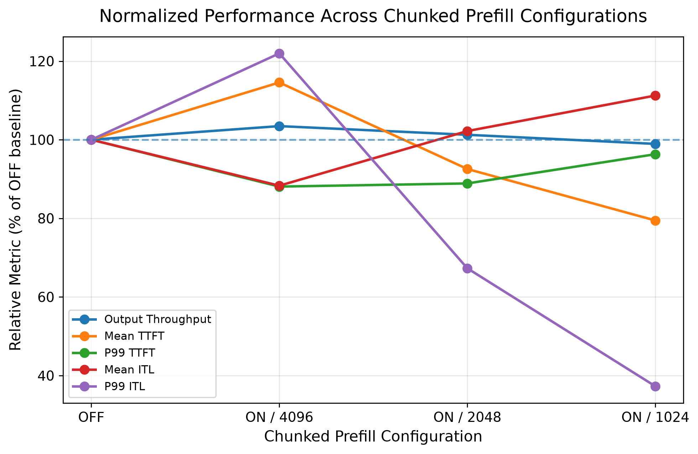
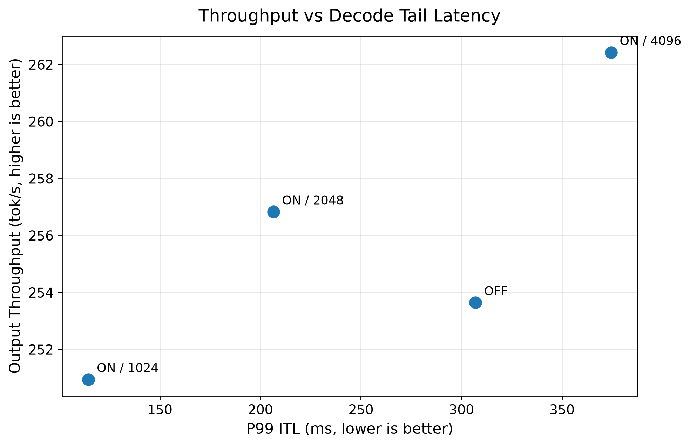
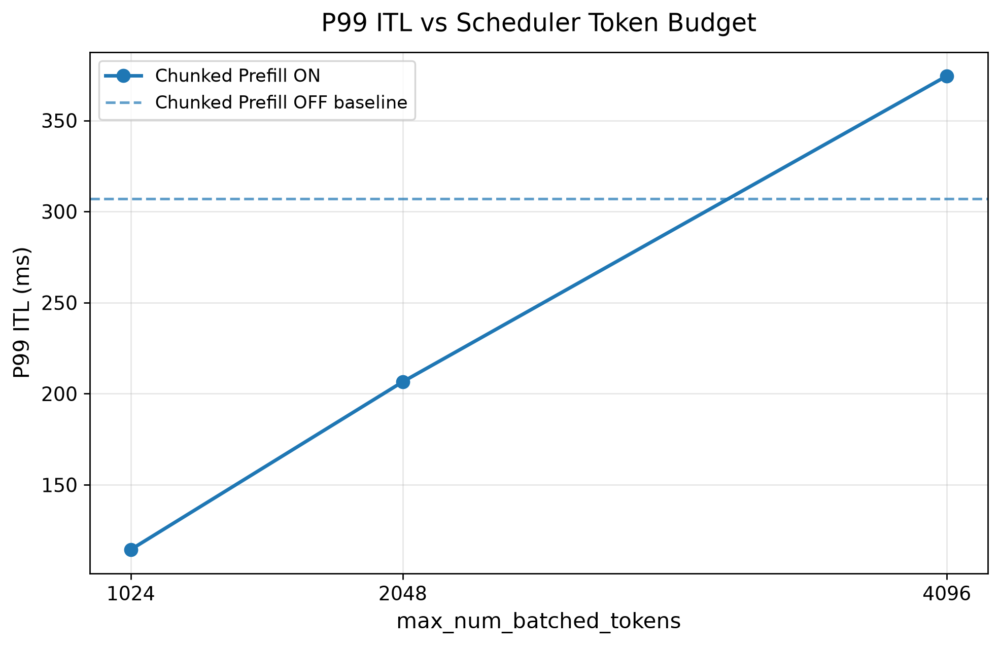

# Stage 7：Chunked Prefill 与 Scheduler Token Budget 实验

## 1. 阶段目标

Stage 7 的目标是研究 **Chunked Prefill** 在长输入、多并发 workload 下对 serving latency 与 throughput 的影响。

本阶段重点关注的问题不是“Chunked Prefill 是否简单让所有指标都变快”，而是：

> 当长 prompt 的 Prefill 被切分并与 Decode request 交错调度时，TTFT、ITL、tail latency 和 throughput 之间会产生怎样的 trade-off？

这一阶段延续前面实验的控制变量思路，并进一步研究 `max_num_batched_tokens` 对 Chunked Prefill 行为的影响。

---

## 2. 实验假设

我：这个chunked prefill是为了更高效的利用gpu的显存对不对，那以我的理解，虽然他切割了prompt进行prefill但是会影响decode，我在实验前可以猜测他会一定程度上影响每个token之间的生成时间，以及所谓的tail latency尾部的token生成的会更慢

GPT：Chunked Prefill 不是主要为了“节省显存”，更准确地说，是为了更好地调度 GPU 计算资源，让长 prefill 不要一次占住整个调度轮次，并且能和 decode request 混合执行。

vLLM 官方对它的描述就是：把大的 prefill 切成更小的 chunk，然后和 decode requests 放到同一个 batch 里；这样可以更好地平衡 compute-bound 的 prefill 和 memory-bound 的 decode，从而改善 GPU utilization。

实验指标：

- Mean TTFT
- P99 TTFT
- Mean ITL
- P99 ITL
- Output Throughput

---

## 3. 实验环境

### Hardware

- GPU：NVIDIA GeForce RTX 3090 24GB

### Software

- vLLM：0.11.2
- PyTorch：2.9.0+cu128
- CUDA：12.8

### Model

- Qwen2.5-3B-Instruct

---

## 4. Workload Design

本阶段固定 workload：

| Parameter | Value |
|---|---:|
| Input Length | 3072 tokens |
| Output Length | 128 tokens |
| Number of Requests | 100 |
| Maximum Concurrency | 8 |
| Request Rate | inf |
| Dataset | random synthetic workload |
| max_model_len | 4096 |
| Prefix Caching | OFF |

Prefix Caching 在所有实验中保持关闭，避免其对 Prefill latency 造成干扰。

---

## 5. Experiment 1：Chunked Prefill OFF vs ON

第一部分先比较：

| Experiment | Chunked Prefill | max_num_batched_tokens |
|---|---|---:|
| A | OFF | 4096 |
| B | ON | 4096 |

这里保持 token budget 不变，只改变 Chunked Prefill 开关。

### 5.1 Results

| Metric | OFF / 4096 | ON / 4096 | Change |
|---|---:|---:|---:|
| Output Throughput (tok/s) | 253.64 | 262.42 | +3.46% |
| Mean TTFT (ms) | 1192.70 | 1366.41 | +14.56% |
| P99 TTFT (ms) | 2478.38 | 2182.84 | -11.92% |
| Mean ITL (ms) | 21.69 | 19.15 | -11.70% |
| P99 ITL (ms) | 306.99 | 374.43 | +21.97% |

### 5.2 Observation

单纯开启 Chunked Prefill，并保持 `max_num_batched_tokens = 4096` 时，结果是 mixed 的：

- Output Throughput 小幅提升
- Mean ITL 有所改善
- P99 TTFT 有所下降
- 但 Mean TTFT 上升
- P99 ITL 反而升高

这说明：

> 仅仅开启 Chunked Prefill，并不能保证所有 latency 指标同时改善。

同时，3072-token input 小于 4096-token budget，因此在这个设置下，一个长 Prefill 很多时候仍然可以在较大的 token budget 中被处理，Chunked Prefill 的细粒度调度优势没有被充分体现。

因此继续进行第二部分实验。

---

## 6. Experiment 2：Scheduler Token Budget Tuning

保持：

```text
Chunked Prefill = ON
Prefix Caching  = OFF
Input Length    = 3072
Output Length   = 128
Concurrency     = 8
```

只改变：

```text
max_num_batched_tokens
4096 → 2048 → 1024
```

可以粗略理解为：

```text
3072-token Prefill

4096 budget:
[3072]

2048 budget:
[2048][1024]

1024 budget:
[1024][1024][1024]
```

这并不表示实际 scheduler 一定严格按照上述边界切分，但可以帮助理解 token budget 变小时，长 Prefill 更容易被拆成多个调度片段。

---

## 7. Full Benchmark Results

| Configuration | Output Throughput (tok/s) | Mean TTFT (ms) | P99 TTFT (ms) | Mean ITL (ms) | P99 ITL (ms) |
|---|---:|---:|---:|---:|---:|
| OFF / 4096 | 253.64 | 1192.70 | 2478.38 | 21.69 | 306.99 |
| ON / 4096 | 262.42 | 1366.41 | 2182.84 | 19.15 | 374.43 |
| ON / 2048 | 256.83 | 1103.82 | 2202.71 | 22.16 | 206.55 |
| ON / 1024 | 250.95 | 947.63 | 2387.01 | 24.12 | 114.42 |

---

## 8. Result Analysis

### 8.1 P99 ITL 显著改善

本阶段最明显的趋势出现在 P99 ITL：

```text
OFF / 4096:  306.99 ms
ON / 4096:   374.43 ms
ON / 2048:   206.55 ms
ON / 1024:   114.42 ms
```

与 OFF baseline 相比，ON / 1024 的 P99 ITL：

```text
306.99 ms
→
114.42 ms
```

下降约 **62.7%**。

从 ON / 2048 到 ON / 1024：

```text
206.55 ms
→
114.42 ms
```

又下降约 **44.6%**。

这说明在当前 workload 下：

> 更小的 scheduler token budget 与更低的 Decode tail latency 相关。

一个合理的解释是，较小 token budget 使长 Prefill 更容易被拆分，从而给 scheduler 更多机会在 Prefill 之间穿插 Decode work，减少少数 Decode token 被长 Prefill 长时间阻塞的情况。

需要注意：

> 本实验没有直接记录 scheduler trace，因此这里只能根据配置与端到端 latency 指标解释现象，不能把具体内部调度顺序当成已经直接测量的事实。

---

### 8.2 Mean ITL 并没有同步改善

Mean ITL：

```text
OFF / 4096: 21.69 ms
ON / 4096:  19.15 ms
ON / 2048:  22.16 ms
ON / 1024:  24.12 ms
```

随着 token budget 从 4096 降低到 1024，P99 ITL 显著改善，但 Mean ITL 反而有所增加。

这说明：

> Tail latency 的改善并不代表平均 Decode latency 一定同步改善。

在当前实验下，更细粒度的 scheduling 对最慢的一批 token gap 更友好，但平均 token interval 存在一定代价。

---

### 8.3 Throughput 略有下降

Chunked Prefill ON 时：

```text
4096: 262.42 tok/s
2048: 256.83 tok/s
1024: 250.95 tok/s
```

从 4096 降到 1024 后，Output Throughput 下降约 **4.4%**。

因此：

> 更细的 Prefill chunking 并不是免费优化。

它可能改善 tail latency，但同时带来一定 throughput cost。

在本实验中，throughput 的变化幅度相对较小，而 P99 ITL 的变化幅度非常明显。

---

### 8.4 TTFT 呈现非单调变化

Mean TTFT：

```text
OFF / 4096: 1192.70 ms
ON / 4096:  1366.41 ms
ON / 2048:  1103.82 ms
ON / 1024:   947.63 ms
```

ON / 1024 的 Mean TTFT 比 OFF baseline 低约 **20.5%**。

但是 P99 TTFT：

```text
OFF / 4096: 2478.38 ms
ON / 4096:  2182.84 ms
ON / 2048:  2202.71 ms
ON / 1024:  2387.01 ms
```

并没有表现出和 Mean TTFT 一样的单调趋势。

不能简单得出：

> token budget 越小，TTFT 一定越好。

更准确的结论是：

> 在当前 workload 中，TTFT 对 Chunked Prefill 与 token budget 的响应比较复杂，Mean 与 P99 的变化并不完全一致。

---

## 9. Normalized Metrics

以 Chunked Prefill OFF 为 100% baseline：

| Configuration | Output Throughput | Mean TTFT | P99 TTFT | Mean ITL | P99 ITL |
|---|---:|---:|---:|---:|---:|
| OFF | 100.0% | 100.0% | 100.0% | 100.0% | 100.0% |
| ON / 4096 | 103.5% | 114.6% | 88.1% | 88.3% | 122.0% |
| ON / 2048 | 101.3% | 92.5% | 88.9% | 102.2% | 67.3% |
| ON / 1024 | 98.9% | 79.5% | 96.3% | 111.2% | 37.3% |

Normalized view 可以更直观地展示不同指标之间的 trade-off：

- P99 ITL 在 1024 budget 下下降到 baseline 的约 37%
- Throughput 仍保持在 baseline 附近
- Mean ITL 则上升到 baseline 的约 111%
- TTFT 指标表现并不完全单调

---

## 10. Figures

### 10.1 Normalized Multi-Metric Comparison



这张图以 OFF baseline = 100%，用于展示不同 configuration 下多个指标的相对变化。

---

### 10.2 Throughput vs P99 ITL Trade-off



这张 scatter plot 用于观察：

- X 轴：P99 ITL，越低越好
- Y 轴：Output Throughput，越高越好

理想配置更接近左上区域。

---

### 10.3 P99 ITL vs Scheduler Token Budget



这张图重点展示 Chunked Prefill ON 时：

```text
4096 → 2048 → 1024
```

随着 token budget 减小，P99 ITL 明显下降。

---

## 11. Key Findings

Stage 7 最重要的结论不是“Chunked Prefill 一定让所有性能指标变好”，而是：

> **Chunked Prefill 的效果高度依赖 scheduler token budget，并体现出明显的 latency-throughput trade-off。**

在当前 workload 下：

1. 仅仅打开 Chunked Prefill，并保持较大的 4096 token budget，并没有带来一致的 latency 改善。
2. 将 token budget 从 4096 降到 2048 和 1024 后，P99 ITL 显著降低。
3. ON / 1024 的 P99 ITL 相比 OFF baseline 下降约 **62.7%**。
4. 但 Mean ITL 随着 budget 减小而上升。
5. Output Throughput 从 ON / 4096 到 ON / 1024 下降约 **4.4%**。
6. TTFT 的变化不是简单单调关系，Mean 和 P99 的趋势不同。

因此：

> 更细粒度的 Chunked Prefill scheduling 可以明显改善 Decode tail latency，但可能以平均 Decode latency 和部分 throughput 为代价。

---

## 12. 实验限制

当前 Stage 7 的结果需要保留以下限制：

1. 每个 configuration 当前只运行了一次正式 benchmark。
2. 当前 workload 使用 synthetic random input。
3. 实验没有直接采集 scheduler trace，因此内部调度行为是根据配置和端到端指标进行解释。
4. 实验没有直接记录 GPU SM utilization、memory bandwidth 或 power 等硬件 counters。
5. 当前结论只适用于本实验环境：
   - Qwen2.5-3B-Instruct
   - RTX 3090
   - concurrency = 8
   - 3072-token input
   - 128-token output

因此不能直接推广到所有模型、GPU 或 production workload。

---

## 13. Stage 7 完成内容

本阶段完成：

- 理解 Chunked Prefill 与 scheduler token budget
- 设计长输入、多并发 workload
- 完成 Chunked Prefill OFF / ON controlled experiment
- 发现单纯开启 Chunked Prefill 的结果存在 mixed behavior
- 进一步测试 `max_num_batched_tokens = 4096 / 2048 / 1024`
- 分析 TTFT、ITL、P99 ITL 与 Throughput trade-off
- 生成 processed CSV
- 编写 `plot_chunked_prefill.py`
- 生成 normalized multi-metric plot
- 生成 throughput-vs-tail-latency scatter plot
- 生成 P99 ITL vs token budget plot