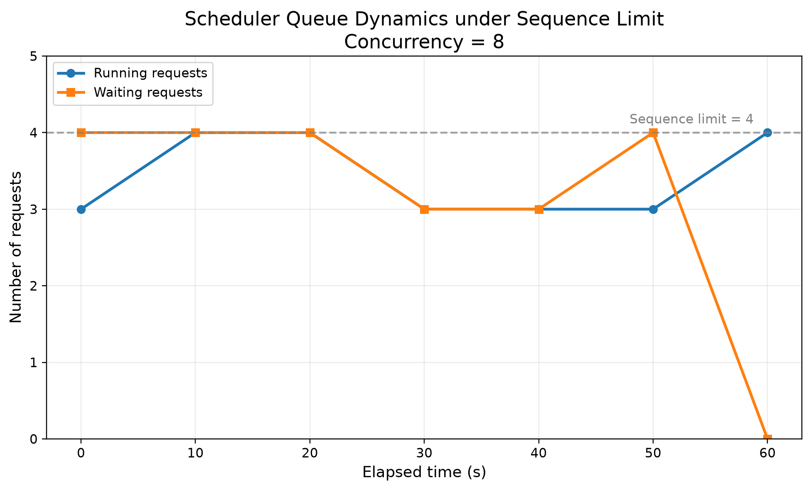
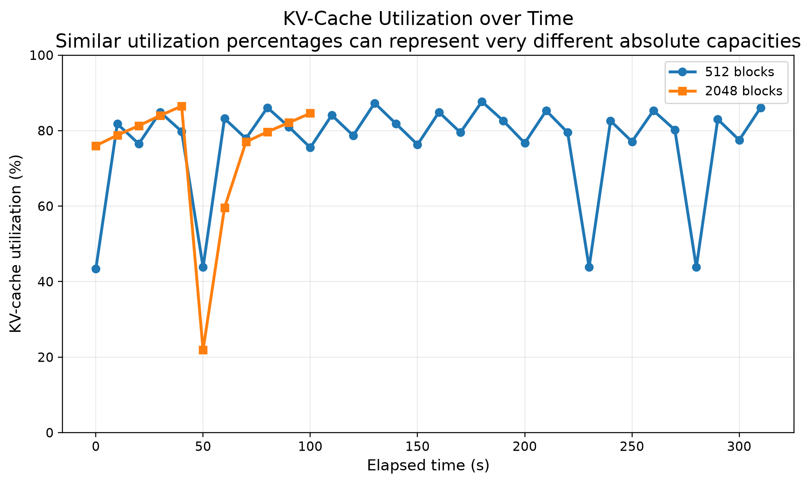
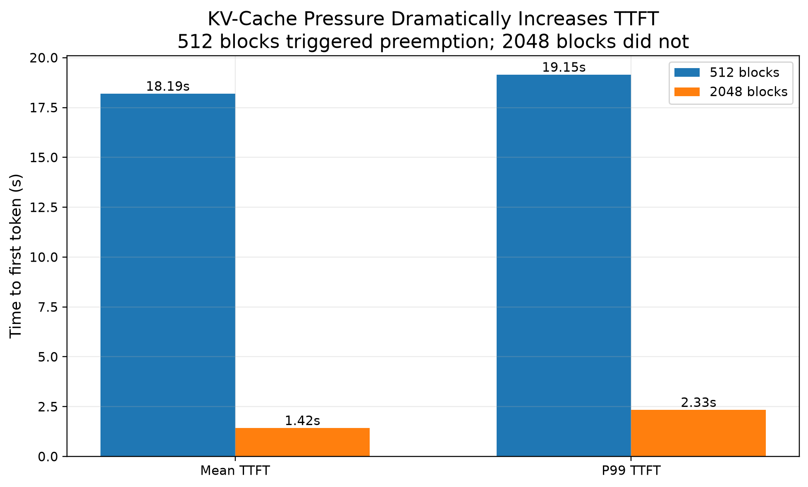

# Stage 8：Scheduler / Preemption 实验

## 1. 阶段目标

Stage 8 的目标是研究：

> 当并发请求过多，或者 GPU KV Cache 不足时，vLLM 的 scheduler 如何管理 Running / Waiting requests，并在什么情况下发生 preemption。

```text
Request 如何竞争 scheduler capacity 和 KV Cache
```

本阶段主要观察：

- Running requests
- Waiting requests
- KV Cache usage
- Preemption
- TTFT
- TPOT / ITL
- Output Throughput

---

## 2. 实验环境

### Hardware

- GPU：NVIDIA GeForce RTX 3090 24GB

### Software

- vLLM：0.11.2

- PyTorch：2.9.0+cu128

- CUDA：12.8

### Model

- Qwen2.5-3B-Instruct

---

## 3. 核心概念

### 3.1 `max_num_seqs`

`max_num_seqs` 可以理解为：

> scheduler 一次最多允许多少条 sequence 处于 active / running 状态。

例如：

```text
max_concurrency = 8
max_num_seqs = 4
```

即使客户端希望同时保持 8 个请求，scheduler 一次也最多允许约 4 个 request 处于 Running，其余 request 需要进入 Waiting。

因此：

```text
max_num_seqs
→ 限制 active sequence 数量
```

而 Stage 7 中的：

```text
max_num_batched_tokens
```

限制的是一次 scheduling iteration 的 token budget。

---

### 3.2 KV Cache Pressure

每个 active sequence 都需要占用 KV Cache。

因此：

```text
更长的 sequence
+
更多并发 request
↓
更高的 KV Cache demand
```

当 KV Cache capacity 不足时，scheduler 可能无法让所有请求同时保持 active。

---

### 3.3 Preemption

当当前 request 继续执行需要新的 KV blocks，但剩余 KV Cache 无法满足分配时，vLLM 可能进行 preemption：

```text
Running Request
      ↓
KV Cache 不足
      ↓
Preempt
      ↓
释放 KV blocks
      ↓
Request 返回 Waiting
      ↓
之后重新调度并 recompute
```

因此：

> Waiting 不一定等于 Preemption。

Waiting 既可能来自 scheduler capacity，也可能来自 KV Cache pressure。

---

## 4. Experiment 1：Scheduler Queue

第一组实验先单独观察 scheduler capacity。

固定：

```text
Input Length        = 3072
Output Length       = 128
Number of Requests  = 100
Concurrency         = 8
Chunked Prefill     = ON
max_num_batched_tokens = 4096
Prefix Caching      = OFF
```

只额外限制：

```text
max_num_seqs = 4
```

### Server

```bash
./scripts/start_server.sh \
  --max-num-seqs 4 \
  --enable-chunked-prefill \
  --max-num-batched-tokens 4096 \
  --no-enable-prefix-caching \
  2>&1 | tee results/raw/queue_server.log
```

### Benchmark

```bash
vllm bench serve \
  --backend openai \
  --base-url http://localhost:8000 \
  --model /root/autodl-tmp/models/Qwen2.5-3B-Instruct \
  --dataset-name random \
  --random-input-len 3072 \
  --random-output-len 128 \
  --num-prompts 100 \
  --request-rate inf \
  --max-concurrency 8 \
  --ignore-eos \
  --save-result \
  --result-dir results/raw \
  --result-filename queue.json
```

---

## 5. Experiment 1 结果

Server log 中观察到：

```text
Running: 3, Waiting: 4, GPU KV cache usage: 2.2%
Running: 4, Waiting: 4, GPU KV cache usage: 2.9%
Running: 3, Waiting: 3, GPU KV cache usage: 2.1%
```

最大观测值：

```text
Running = 4
Waiting = 4
```

而 KV Cache usage 始终非常低，峰值约：

```text
2.9%
```

因此这一组 Waiting 的主要原因不是 KV Cache，而是：

```text
max_num_seqs = 4
```

造成的 scheduler capacity limit。

### Benchmark Results

| Metric | Result |
|---|---:|
| Output Throughput | 193.61 tok/s |
| Mean TTFT | 2879.14 ms |
| P99 TTFT | 3519.32 ms |
| Mean TPOT | 18.26 ms |
| Mean ITL | 18.26 ms |
| P99 ITL | 303.88 ms |
| Preemptions | 0 |

与 Stage 7 中相同的 3072 / 128 / concurrency 8 workload 相比，限制 `max_num_seqs = 4` 后：

- Output Throughput 从 262.42 降到 193.61 tok/s

- Mean TTFT 从 1366.41 上升到 2879.14 ms

- P99 TTFT 从 2182.84 上升到 3519.32 ms

这说明：

> Scheduler queueing 主要显著增加 TTFT，同时降低 overall throughput。

### Figure



---

## 6. Experiment 2：KV Cache Pressure / Preemption

第二组实验把：

```text
max_num_seqs = 8
max_concurrency = 8
```

保持一致，避免 scheduler sequence limit 成为主要限制。

固定 workload：

```text
Input Length        = 3072
Output Length       = 512
Number of Requests  = 100
Concurrency         = 8
Chunked Prefill     = ON
max_num_batched_tokens = 4096
Prefix Caching      = OFF
block_size          = 16
```

只改变：

```text
num_gpu_blocks_override
512
vs
2048
```

### KV Cache Capacity

由于：

```text
block_size = 16
```

可以粗略理解为：

```text
512 blocks  × 16 ≈ 8192 token positions
2048 blocks × 16 ≈ 32768 token positions
```

而 8 个 request 最多可能需要：

```text
8 × (3072 + 512)
= 28672 token positions
```

因此 512 blocks 会人为制造强 KV Cache pressure，而 2048 blocks 作为更宽松的 control。

---

## 7. 512 Blocks：High KV Pressure

Server 配置：

```bash
./scripts/start_server.sh \
  --max-num-seqs 8 \
  --enable-chunked-prefill \
  --max-num-batched-tokens 4096 \
  --no-enable-prefix-caching \
  --block-size 16 \
  --num-gpu-blocks-override 512 \
  2>&1 | tee results/raw/preempt_512_server.log
```

通过 `/metrics` 验证：

```text
block_size="16"
num_gpu_blocks="512"
num_gpu_blocks_override="512"
enable_prefix_caching="False"
```

运行期间长期观察到：

```text
Running ≈ 1–2
Waiting ≈ 6
KV Cache usage ≈ 75–88%
```

例如：

```text
Running: 2, Waiting: 6, GPU KV cache usage: 81.8%
Running: 2, Waiting: 6, GPU KV cache usage: 86.1%
Running: 2, Waiting: 6, GPU KV cache usage: 87.7%
```

同时：

```text
vllm:num_preemptions_total = 1
```

说明该 workload 下实际发生了 1 次 preemption。

但是

> 18 秒级 TTFT 不能简单归因于这一次 preemption。

```text
KV Cache capacity 很小
↓
只能维持少量 Running requests
↓
大量 requests 长期 Waiting
↓
严重 queueing
+
一次 Preemption
↓
TTFT 大幅增加、Throughput 降低
```

---

## 8. 2048 Blocks：Control

只改变：

```text
512 blocks
→
2048 blocks
```

其他主要参数完全相同。

Server log 大部分时间可以维持：

```text
Running: 8
Waiting: 0
```

并观察到一次明显的过渡过程：

```text
Running 3 / Waiting 5
↓
Running 7 / Waiting 1
↓
Running 8 / Waiting 0
```

同时：

```text
vllm:num_preemptions_total = 0
```

说明更大的 KV Cache capacity 可以让更多 request 同时保持 active，并消除本 workload 下观察到的 preemption。

### Figures




---

## 9. 512 vs 2048 Benchmark Results

| Metric | 512 Blocks | 2048 Blocks |
|---|---:|---:|
| Benchmark Duration | 310.48 s | 111.47 s |
| Request Throughput | 0.32 req/s | 0.90 req/s |
| Output Throughput | 164.90 tok/s | 459.32 tok/s |
| Mean TTFT | 18191.01 ms | 1423.19 ms |
| P99 TTFT | 19145.17 ms | 2334.76 ms |
| Mean TPOT | 11.57 ms | 14.10 ms |
| Mean ITL | 11.57 ms | 14.10 ms |
| P99 ITL | 12.06 ms | 14.95 ms |
| Preemptions | 1 | 0 |

---

## 10. Result Analysis

### 10.1 TTFT 大幅下降

Mean TTFT：

```text
18191.01 ms
→
1423.19 ms
```

下降约：

```text
92.2%
```

P99 TTFT：

```text
19145.17 ms
→
2334.76 ms
```

下降约：

```text
87.8%
```

主要原因是 2048 blocks 下能够让更多 requests 同时保持 active，大幅减少 Waiting time。

---

### 10.2 Output Throughput 大幅提高

Output Throughput：

```text
164.90
→
459.32 tok/s
```

提升约：

```text
178.5%
```

约为原来的：

```text
2.79×
```

更大的 KV Cache capacity 让 continuous batching 能同时服务更多 active sequences。

---

### 10.3 TPOT / ITL 并没有同步改善

Mean TPOT：

```text
11.57
→
14.10 ms
```

P99 ITL：

```text
12.06
→
14.95 ms
```

反而略有增加。

```text
512 blocks
→ active requests 较少
→ 单个 active request 的 decode contention 较低
2048 blocks
→ 更多 requests 同时 active
→ overall throughput 更高
→ per-request token latency 略有增加
```

> LLM serving optimization 是 throughput、queueing、memory capacity 和 per-token latency 之间的 trade-off，而不是所有指标同时改善。

---

## 11. Performance Figures

### TTFT



### Throughput–Latency Trade-off


512 blocks：

```text
Mean TTFT ≈ 18.19 s
Output Throughput ≈ 164.90 tok/s
Preemptions = 1
```

2048 blocks：

```text
Mean TTFT ≈ 1.42 s
Output Throughput ≈ 459.32 tok/s
Preemptions = 0
```

---

## 12. Key Findings

1. **Waiting 不等于 Preemption。**

   `max_num_seqs = 4` 时，即使 KV Cache usage 不到 3%，仍然可以产生 Waiting queue。

2. **KV Cache capacity 会直接限制 active concurrency。**

   512 blocks 下长期只有约 1–2 个 Running requests，而约 6 个 requests 处于 Waiting。

3. **严重 KV Cache pressure 可以触发 Preemption。**

   512 blocks 下：

   ```text
   num_preemptions_total = 1
   ```

   2048 blocks 下：

   ```text
   num_preemptions_total = 0
   ```

4. **更大的 KV Cache capacity 显著改善 TTFT 与 Throughput。**

   ```text
   Mean TTFT ↓ 92.2%
   Output Throughput ↑ 178.5%
   ```

5. **更高 throughput 并不意味着所有 latency 指标都更低。**

   2048 blocks 下 TPOT / ITL 略高，体现了 serving system 中的 throughput–latency trade-off。

---

## 13. 实验限制

1. 每个主要 configuration 当前只运行了一次正式 benchmark。

2. workload 使用 synthetic random input。

3. Running / Waiting / KV usage 来自周期性 server log，而不是逐 iteration scheduler trace。

4. 512 blocks 下通过 `num_preemptions_total = 1` 确认发生 preemption，但 server log 中没有直接记录单独的 preemption warning。

5. `num_gpu_blocks_override` 是人为制造 KV pressure 的 stress-test 配置，不代表 production 推荐参数。

6. Experiment 1 使用 128-token output，而 Experiment 2 使用 512-token output，因此两组实验之间不能直接做严格性能对比。

7. 当前结论只适用于本实验环境：

   - Qwen2.5-3B-Instruct

   - RTX 3090

   - vLLM 0.11.2

---

## 14. Stage 8 完成内容

本阶段完成：

- 理解 Running / Waiting requests
- 理解 `max_num_seqs`
- 完成 Scheduler Queue controlled experiment
- 观察 scheduler-capacity-induced queueing
- 使用 `num_gpu_blocks_override` 制造 KV Cache pressure
- 完成 512 / 2048 blocks controlled experiment
- 通过 `/metrics` 验证 KV Cache 配置
- 观察 KV Cache pressure 下的 Running / Waiting 状态
- 成功触发并记录 Preemption
- 分析 TTFT、TPOT、ITL 与 Throughput trade-off
- 生成 `stage8_summary.csv`
- 生成 `stage8_scheduler_trace.csv`
- 编写 `plot_scheduler_preemption.py`
